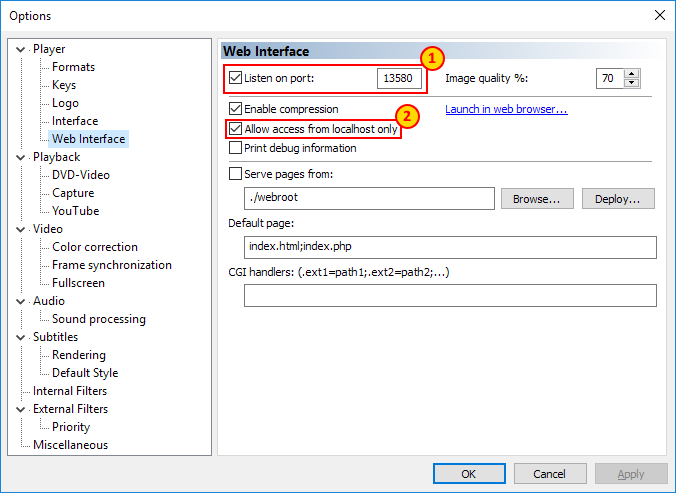

# MPC-HC/MPC-BE Web API Proxy

The [MPC-HC](https://mpc-hc.org/) application, and its derivative [MPC-BE](https://sourceforge.net/projects/mpcbe/) are wonderful and lightweight media players, used by many around the world. As part of its feature-set it contains the ability to listen on a local port, acting as a HTTP server with various remote control functions. This is very convenient for making local integrations (for example, via [Home Assistant](http://home-assistant.io/) for home automation) or for remote control over a LAN using one of the dozen or more phone applications.

The major downside to this is that the MPC-HC web interface is hilariously insecure. There is no authentication, and remote clients can happily see your preferences for *My Little Pony* reruns, make your PC play arbitrary files, or just generally mess with your media client.

This script acts as a form of local proxy/firewall, emulating a limited version of the MPC-HC web UI - enough for remote integrations to observe and have limited control - while maintaining some control over your system.

## Dependencies

Python 3.5 or newer is required. The `aiohttp` library is also required:

```
pip install aiohttp
```

## Feature Support

Currently Supported:
- Whitelist of allowed commands from remote clients for pass-through (`commands.html`) via GET or POST requests
- Passthrough and redaction of state information (`variables.html`, `info.html`, `status.html`)

Currently NOT Supported:
- Emulation of the file browser in the remote UI (may break some remote control clients)

## Setup



Enable the Web UI in MPC-HC's options screen. Make sure the option to only allow requests from `localhost` is set, so that the script can interact with it but remote clients cannot access the real MPC-HC interface. Choose a port that is not the default of 13579 (as the proxy script will bind to this port instead).

Currently, configuring the script requires hand-editing. Edit the following variables in the script:

```PORT``` - The port the script will listen on. By default MPC-HC listens on port 13579, so you should probably use that to maintain compatibility.

```MPCHC_PORT``` - The port MPC-HC is currently listening on. This should be different to the default of 13579 and should match your MPC-HC settings.

```VARIABLE_REDACTIONS``` - Variables returned by MPC-HC that should *not* be passed on to remote clients.

```ALLOWED_COMMAND_IDS``` - Command IDs which remote clients are allowed to issue. The list of commands can be found by viewing the HTML source of the real MPC-HC's web UI root page.

## Use

Run the script in the background (on Windows, use `pythonw.exe` to run it as a hidden background process). When MPC-HC is running requests to the proxy will be passed through in both directions with the appropriate access controls/redactions.

## License

See [here](LICENSE.md) for full license details.
